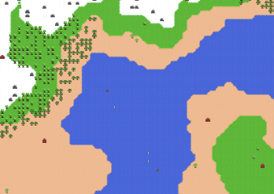

# Glish.js

<div style="text-align:center">  
  
  

</div>


Glish.js is a typescript test project that generate random maps.
I'm mainly using this repo to play with typescript


## Usage

```bash
yarn && yarn dev
```

## Test

```bash
yarn && yarn test
```

## Infos

I'm currenly on adding a CLI to ease the dev of the project

## Contributing
Pull requests are welcome. For major changes, please open an issue first to discuss what you would like to change.

Please make sure to update tests as appropriate.

## License
[MIT](https://choosealicense.com/licenses/mit/)
